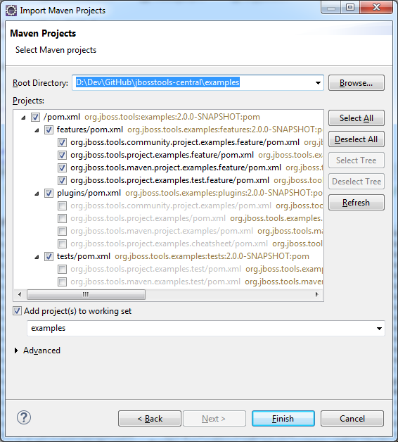
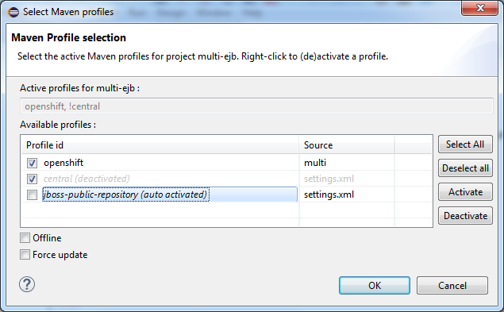
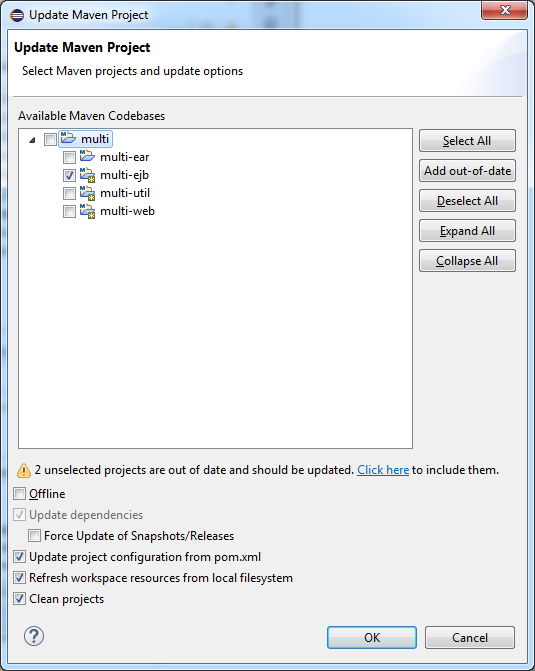
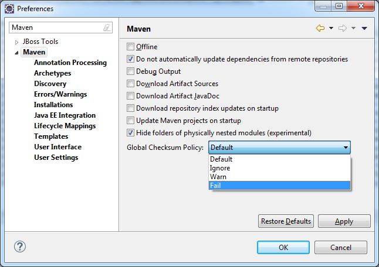
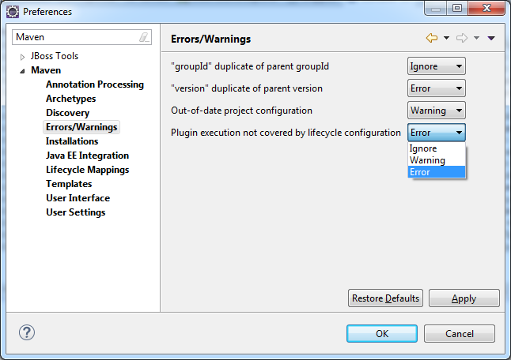

[M2Eclipse](https://www.eclipse.org/m2e), released version 1.5.0 a few weeks ago, as part of the
annual Eclipse release train, this year known as Luna. [77 Bugs](https://bugs.eclipse.org/bugs/buglist.cgi?bug_status=UNCONFIRMED&bug_status=NEW&bug_status=ASSIGNED&bug_status=REOPENED&bug_status=RESOLVED&bug_status=VERIFIED&bug_status=CLOSED&classification=Technology&columnlist=target_milestone%2Ccomponent%2Cassigned_to%2Cresolution%2Cshort_desc%2Cchangeddate&known_name=m2e%201.5&list_id=9536440&product=m2e&query_based_on=m2e%201.5&query_format=advanced&resolution=---&resolution=FIXED&resolution=INVALID&resolution=WONTFIX&resolution=DUPLICATE&resolution=WORKSFORME&resolution=MOVED&resolution=NOT_ECLIPSE&target_milestone=1.5.0%2FLuna%20M1&target_milestone=1.5.0%2FLuna%20M2&target_milestone=1.5.0%2FLuna%20M3&target_milestone=1.5.0%2FLuna%20M4&target_milestone=1.5.0%2FLuna%20M5&target_milestone=1.5.0%2FLuna%20M6&target_milestone=1.5.0%2FLuna%20M7&target_milestone=1.5.0%2FLuna%20RC2) were fixed as part of that release, compatible with both Eclipse Kepler and Luna. I believe it’s a pretty solid one, with numerous interesting fixes and usability improvements that deserve a blog post. So here goes, in no particular order:

# Improved project import workflow

Selecting Maven projects to import used to take an inordinate amount of time, due to a suboptimal - I love that word :-) - Maven Lifecycle
Mapping Analysis (LMA). LMA is used to determine whether the projects would require further configuration to operate properly in Eclipse. That LMA is now only run after projects are imported, making selection of projects to import much, **much** faster (\< couple seconds vs 1-2 min for the wildfly 8.0 codebase and its 130 projects, for instance)

After import, lifecycle mapping error markers are collected on imported projects and the discovery service is invoked to find proposals to fix those errors.

Another improvement to this workflow is the ability to easily import multi-module projects to an Eclipse Working Set. The default name is inferred from the root project but can be overridden manually:

More [performance](http://bugs.eclipse.org/436679) [improvements](http://bugs.eclipse.org/436668) during import itself are to be expected to be included in M2Eclipse 1.6.0.

See bugs [409732](https://bugs.eclipse.org/409732), [408042](https://bugs.eclipse.org/408042) and [417466](https://bugs.eclipse.org/417466).

# Improved memory consumption

Maven project instance caching strategy has been revisited to reduce memory consumption. For a workspace with 300+ projects for instance, heap memory used went from 2.5GB down to well under 1GB without any noticeable side effects.

See [Igor’s announcement](https://dev.eclipse.org/mhonarc/lists/m2e-dev/msg01389.html) and bug [410954](https://bugs.eclipse.org/410954).

# Nexus index download disabled by default

Before M2Eclipse 1.5, by default, Nexus indexes were downloaded on new workspace startup, then subsequently once a week. Depending on your internet connection, that whole process could take 15 minutes or more, heavily pegging the CPU. Once the indexes were updated, the size of the workspace would increase by approximately 500 MB. Even though space is relatively cheap these days, those with many workspaces (eg., for testing) or large workspaces, this extra disk usage can add up quickly.

M2Eclipse 1.5.0 now has this feature disabled by default. You can still enable it in menu:Preferences[Maven \> Download repository index updates on startup]. One major downside of having this feature disabled by default though, is Archetype and Artifact/Plugin searches are now much less efficient, as they rely on this indexed content.

See bug [404417](https://bugs.eclipse.org/404417)

# New Maven Profile management UI

The JBoss Tools team contributed its [Maven Profile management interface](https://marketplace.eclipse.org/content/maven-profiles-management)
to M2Eclipse 1.5.0. This new interface eases switching between profiles.

Rather than right-clicking on a project, going to the menu:Properties[Maven] page, then manually (mis)typing a list of active or disabled profiles, you can now just use kbd:[Ctrl+Alt+P] to open the new Maven Profile selection interface.

The new interface is also accessible from the Maven context menu: Right-click project menu:Maven[Select Maven Profiles…]

The list of available profiles is inferred from profiles defined in:

-   the project pom.xml
-   the project’s parent hierarchy
-   user and global maven settings.xml

When several projects are selected, only the common available profiles are displayed for selection. Common profiles are profiles defined in settings.xml or profiles having the same id in different pom.xml.

You can learn more about that feature from the original [JBoss Tools blog](http://docs.jboss.org/tools/whatsnew/maven/maven-news-3.3.0.M3.html#itemname1)

See bug [428094](https://bugs.eclipse.org/428094)

# Easily update outdated projects

The Update Maven Project dialog (launched via Right-click project menu:Maven[Update Project…] or via kbd:[Alt-F5]), now shows a *dirty* overlay on projects which need updating.

Additionally, an "Add out-of-date" button adds all out-of-date (OOD) projects to the current selection. If an OOD project has not been selected, a warning is shown underneath the selection table with a link equivalent to "Add out-of-date". Warning text and "Add out-of-date" button tooltip show a count of unselected OOD projects.

See it in action: <http://screencast.com/t/27S0qeca>

See bug [422667](https://bugs.eclipse.org/422667)

# No more `Unsupported IClasspathEntry kind=4`

There’s a very popular [question on StackOverflow](http://stackoverflow.com/questions/10564684/how-to-fix-error-updating-maven-project-unsupported-iclasspathentry-kind-4) about an M2Eclipse bug that plagued many users of the maven-eclipse-plugin: M2Eclipse would throw `Unsupported IClasspathEntry kind=4` exceptions on classpath entries generated by the maven-eclipse-plugin (one of the reasons why you should never mix maven-eclipse-plugin and M2Eclipse).

M2Eclipse 1.5.0 no longer complains about these unsupported classpath entries, but unexpected classpath issues may still arise, should you mix duplicate jars from M2Eclipse and those added by the maven-dependency-plugin.

See bug <https://bugs.eclipse.org/394042>

# New checksum settings

Ever connected to a network with limited Internet access or simply stayed at a hotel where you needed to get past a for-pay-firewall, resulting in HTML pages being downloaded instead of jars? There’s nothing better to pollute your local Maven repository. Maven CLI builds
can use these flags:

-   `-C` - fail build if checksums do not match

-   `-c` - warn if checksums do not match

M2Eclipse now has a global Checksum Policy available in menu:Preferences[Maven], that will help you keep your sanity, and your
local repository clean:

While M2Eclipse actually won’t create any Warning markers on projects when
"Warn" is selected, it will override existing checksum policies set on
repositories.

See bug <https://bugs.eclipse.org/418674>

# Improved settings for Errors/Warnings preferences

M2Eclipse has been known for generating specific errors that have puzzled more
than one user in the past:

-   `Project Configuration is not up-to-date` - a change in pom.xml
    **might** require a full project configuration update.

-   `Plugin execution not covered by lifecycle` - M2Eclipse doe not know if it
    is safe to execute a maven plugin as part of the Eclipse build

With the new menu:Preferences[Errors/Warnings] page, users can now
decide according to their own needs whether these errors should be
downgraded to `Warning`, or even be ignored entirely.

See bugs [433776](https://bugs.eclipse.org/433776),
[434053](https://bugs.eclipse.org/434053)

# Maven runtime changes

A few changes have been made with regards to the Maven runtime(s):

-   The embedded Maven runtime has been updated to maven 3.2.1.

-   The Netty/AsynHttpClient transport layer as been replaced with
    OkHttp 1.5.4. OkHttp is now the default HTTP client on the Android
    platform. It brings HTTP 2.0 and SPDY support to artifact downloads.
    Please note though, NTLM authentication is [not
    supported](https://github.com/square/okhttp/issues/206).

-   Maven runtime installations can now be customized with a name, and
    additional libraries can be added. Maven Launch configurations now
    reference the Maven runtime by name, instead of using a hard-coded
    location so the configuration is more portable.

See bugs [427932](https://bugs.eclipse.org/427932),
[418263](https://bugs.eclipse.org/418263),
[432436](https://bugs.eclipse.org/432436)

# Accept contributions from Gerrit

In order to lower the contribution barrier and increase contributor diversity, the M2Eclipse project now [accepts changes](https://wiki.eclipse.org/M2E_Development_Environment#Submitting_patches) contributed via the [Gerrit](https://code.google.com/p/gerrit/) review system. Head over the [wiki](http://wiki.eclipse.org/Gerrit) that explains how to use it. Does it work? [Hell yeah](https://git.eclipse.org/r/#/q/m2e-core,n,z)! After several significant [contributions](http://git.eclipse.org/c/m2e/m2e-core.git/log/?qt=author&q=Anton+Tanasenko), [Anton Tanasenko](https://plus.google.com/107693438225172488731/posts)
has joined the M2Eclipse team as commiter!

Welcome Anton!

See bug [374665](https://bugs.eclipse.org/374665)

# Conclusion

With new blood on the m2e team, numerous fixed bugs and some big new features & improvements, m2e 1.5.0 is a pretty exciting release. Hope you guys appreciate this year’s release, before an even better version next time.

So if you haven’t installed m2e 1.5.0 yet, head over to <https://www.eclipse.org/m2e/download/> and have at it.

We’d love to hear your feedback on the [mailing list](https://dev.eclipse.org/mailman/listinfo/m2e-users), or whether you [report bugs or enhancement requests](https://bugs.eclipse.org/bugs/enter_bug.cgi?product=m2e).

Article originally taken from the [JBoss Blog][1]. Thanks to Fred Bricon for writing up our release notes :-)

[1]: http://tools.jboss.org/blog/2014-07-08-m2e-1_5-improvements.html
