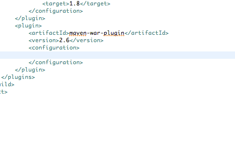
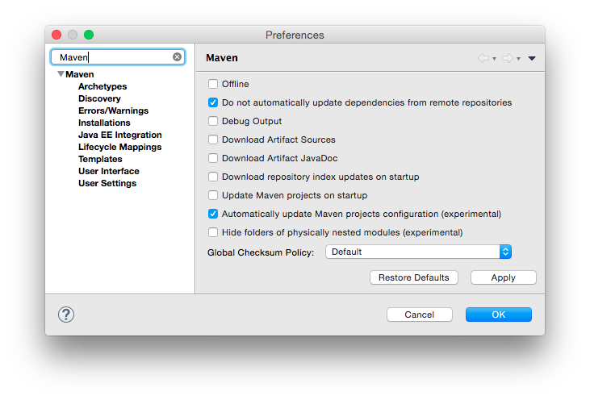

[M2Eclipse](https://www.eclipse.org/m2e) released version 1.6.0 as part of the
Eclipse Mars release train. There are [86 Bugs](https://bugs.eclipse.org/bugs/buglist.cgi?bug_status=RESOLVED&bug_status=VERIFIED&bug_status=CLOSED&list_id=12090411&product=m2e&query_format=advanced&target_milestone=1.6.0%2FMars%20M1&target_milestone=1.6.0%2FMars%20M2&target_milestone=1.6.0%2FMars%20M3&target_milestone=1.6.0%2FMars%20M4&target_milestone=1.6.0%2FMars%20M5&target_milestone=1.6.0%2FMars%20M6&target_milestone=1.6.0%2FMars%20M7&target_milestone=1.6.0%2FMars%20RC1&target_milestone=1.6.0%2FMars%20RC2) fixed as part of this release. Even though M2EClipse 1.6.0 targets Eclipse Mars, it should still be compatible with Eclipse Luna. Along with improving the overall performance in a number of areas, we made some nice usability improvements and bug fixes worth highlighting:

# New Embedded Maven 3&#46;3&#46;3 runtime

  The embedded Apache Maven runtime has been updated to maven 3.3.3. The [Core Extension mechanism](http://takari.io/2015/03/19/core-extensions.html) is honored when running launch configurations (as in `Run` > `Run as...` > `Maven build`). However, custom configurations and extensions in `.mvn` will be ignored during regular Eclipse builds. If you're interested in playing with [polyglot Maven](http://takari.io/2015/03/19/polyglot-maven.html) support for M2Eclipse, you can try the experimental [M2Eclipse polyglot POC](https://github.com/jbosstools/m2e-polyglot-poc).

# Improved auto&#45;completion in pom&#46;xml editor

  The `pom.xml` editor has some nice improvements in the content-assist area: deeply nested plugin configuration elements, such as `manifest` attributes, can now be auto-completed:

  Pro tip : Make sure the plugin version is locked, so the content assist engine can infer which attributes are available.

# New experimental Auto&#45;update configuration feature

  Remember the time when every time you changed something in your pom.xml, you'd get an `Out-of-Date project configuration` error marker? With M2Eclipse 1.6 we introduced an new mechanism that will automatically update the project configuration when configuration changes are made in a `pom.xml`. This feature needs to be manually enabled in the Maven Preferences:

  

  This feature is marked as experimental and disabled by default as we found that, in some rare cases, infinite build loops might be triggered. If and when that happens, simply disable the preference, that should end the build loop.

# Better archetype support

  The embedded maven-archetype-plugin version was bumped to 2.3, which was a long overdue update. That fixed several outstanding archetype related issues.

  The performance was improved when handling large archetype catalogs. Eg. reading Maven Central's catalog (http://repo1.maven.org/maven2/) and its 10k archetypes is about 10 times faster.

# Conclusion

So if you haven’t installed M2Eclipse 1.6.0 yet, head over to <https://www.eclipse.org/m2e/download/> and have at it.

We’d love to hear your feedback on the [mailing list](https://dev.eclipse.org/mailman/listinfo/m2e-users), and please [report bugs or enhancement requests](https://bugs.eclipse.org/bugs/enter_bug.cgi?product=m2e) if you see the need.
