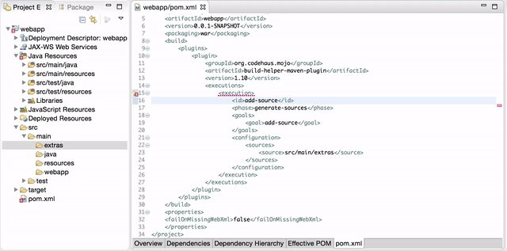

[M2Eclipse](https://www.eclipse.org/m2e) released version 1.7.0 as part of the
Eclipse Neon release train. [49 issues](https://bugs.eclipse.org/bugs/buglist.cgi?bug_status=RESOLVED&bug_status=VERIFIED&bug_status=CLOSED&product=m2e&query_format=advanced&target_milestone=1.7.0%2FMars%20M1&target_milestone=1.7.0%2FNeon%20M2&target_milestone=1.7.0%2FNeon%20M3&target_milestone=1.7.0%2FNeon%20M4&target_milestone=1.7.0%2FNeon%20M5&target_milestone=1.7.0%2FNeon%20M6&target_milestone=1.7.0%2FNeon%20M7&target_milestone=1.7.0%2FNeon%20RC1&target_milestone=1.7.0%2FNeon%20RC2&target_milestone=1.7.0%2FNeon%20RC3&target_milestone=1.7.0%2FNeon%20RC4) were fixed as part of this release. Even though M2EClipse 1.7.0 targets Eclipse Neon, it should still be compatible with Eclipse Mars. This release comes with some  usability improvements and bug fixes worth highlighting:

# Updated versions of embedded runtimes

  * The embedded Apache Maven runtime has been updated to maven 3.3.9.
  * The embedded maven-archetype-plugin version was bumped to 2.4

# Autocompletion for directory/file based properties in the POM xml editor

  Content assist is now available for directory/file based properties, in the POM xml editor:

  

  It applies on:

  * Certain pom model elements (build/{directory, sourceDirectory, scriptSourceDirectory, testSourceDirectory, outputDirectory, testOutputDirectory, filters/filter});
  * Plugin configuration elements which allow files (either File type or name ends with 'directory');
  * Modules.

# Support for smart import of Maven projects
m2e contributes to Eclipse Neon' [smart import mechanism](https://www.eclipse.org/neon/noteworthy/#_import_projects), that lets you import a folder in the workspace, and automatic Maven configuration will be applied if the folder is identified as a Maven project (i.e contains a pom.xml).

# New syntax for specifying lifecycle mapping metadata

A new syntax has been introduced to simplify lifecycle mapping metadata for plugin executions, using processing instructions within plugin/executions/execution nodes.



Supported syntax:

* `<?m2e ignore?>` this execution will be ignored;
* `<?m2e execute?>` this execution will be executed once on project import;
* `<?m2e execute onConfiguration?>` this execution will be executed on every Project Configuration update;
* `<?m2e execute onIncremental?>` this execution will be executed on every incremental build;
* `<?m2e execute onConfiguration,onIncremental?>` this execution will be executed on every Project Configuration update and every incremental build;
* `<?m2e configurator configuratorId?>` this execution will be delegated to the matching m2e configurator.

Each instruction can be placed in the `<execution>` node, this way it applies on this exact execution or on any execution of the same plugin with the same executionId in child pom. It can also be placed in a `<plugin>` node, this way it acts the same as a dedicated `<pluginManagement>` section which lists all goals of this plugin.

Please be aware there are currently no Quick Fixes available to automatically inject these new instructions when a "Plugin Execution Not Covered" error marker is found.

# Support for plugin embedded archetype catalogs
m2e now correctly supports Maven archetype catalogs embedded in other Eclipse plugins. The following extension point can be used within a plugin.xml:

```
<extension point="org.eclipse.m2e.core.archetypeCatalogs">
     <local name="path/local/to/eclipse/bundle/archetype-catalog.xml" description="My Embedded Catalog"/>
  </extension>
```

# New API for overloading Maven POM properties
A new API is available for 3rd party plugins to override project properties through the [org.eclipse.m2e.core.project.ResolverConfiguration]( http://git.eclipse.org/c/m2e/m2e-core.git/tree/org.eclipse.m2e.core/src/org/eclipse/m2e/core/project/ResolverConfiguration.java).

This new API is consumed by [Rastislav Wágner](https://github.com/rawagner)'s [m2e-properties plugin](https://github.com/rawagner/m2e-properties) ([screencast](https://www.youtube.com/watch?v=Njk-otnw9a0&feature=youtu.be))


# Conclusion
For this release, 14 [Gerrit changesets](https://git.eclipse.org/r/#/q/project:m2e/m2e-core+status:merged) were merged, from 7 external contributors. So, special thanks to:

* Nick Boldt
* Mickaël Istria
* Gábor Lipták
* Carsten Pfeiffer
* Rastislav Wagner
* Konrad Windszus

Please, keep them contributions coming!

Now, if you still haven’t installed M2Eclipse 1.7.0 yet, head over to <https://www.eclipse.org/m2e/download/> and knock yourselves out!

We’d love to hear your feedback on the [mailing list](https://dev.eclipse.org/mailman/listinfo/m2e-users), and please [report bugs or enhancement requests](https://bugs.eclipse.org/bugs/enter_bug.cgi?product=m2e) if you  find any problems.
